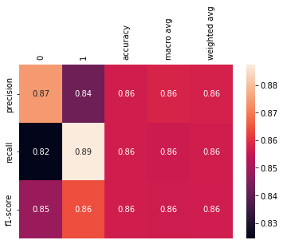
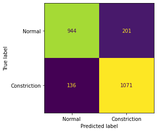
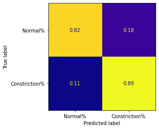
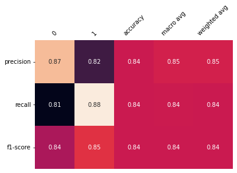
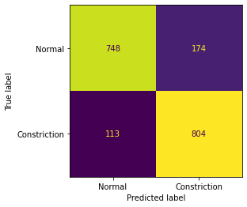
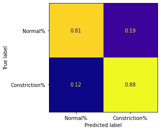

# ArcelorMittal_project

# Problem 

The client asked us to predict a fault occuring during the production process (width constriction), using only data known a priori.

Specifically a difference in width between 140-170m of more then 4-5mm is counted as a constriction.

### Example constriction

|  ||
| --- | --- |

- B4 measurment happens before downcoiling
- B5 measurment happens after downcoiling

# Solution

## Classification

Before we could create our models we first needed to classify our existing data.

To classify the data we needed to compare measuring data from before and after the downcoiling process.

Because the measuring points dont line up one-to-one we created 2 different algoritms to determine a constriction:

 - Comparing the closest points
 - Comparing the averages

both methods gave us similar results.

## Modeling

### Data

We ended up with an unbalanced dataset (which is not uncommon in fault detection) where it is difficult to create accurate models for.

There are many different methods to work with unbalanced data and because we had a lot of datapoints we chose for under-sampling.

We used a random undersampling algoritm that tries to balance out both classes.

### Models

We tried different models with the different under-sampling techniques and in the end random forest gave us the best results for our metrics so we stuck with that.

### Optimization

#### Resampling (**Downsampling**)

Because our dataset is unbalanced our models would be very baised towards one of the groups in classification.We used downsampling to reduce the amount of datapoints for non-constricted coils to balance out the dataset.

### Feature Selection

To create the best model we graphed the different features in relation to the amount of constrictions and used this to select the features that look to have the most impact on constrictions.

#### Feature Importance

When building our models we also looked at the importances of each feature so we could remove ones that had little impact.

| Before | After |
| --- | --- |
|  |  |

### Result

### Model Evaluation

#### Method 1

- 0 represents no constriction
- 1 represents a constriction

Confusion Matrix

| Amounts | Percentages |
| --- | --- |
|  |  |

#### Method 2

Classification Report

- 0 represents no constriction
- 1 represents a constriction

Confusion Matrix

| Amounts | Percentages |
| --- | --- |
|  |  |

