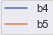
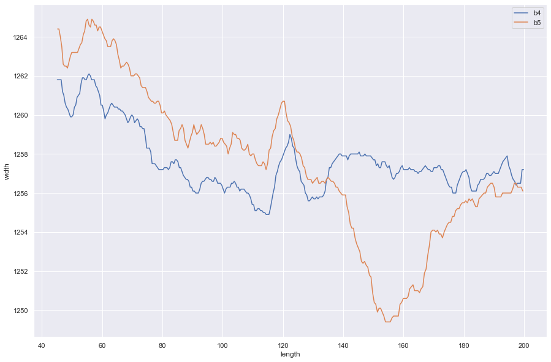
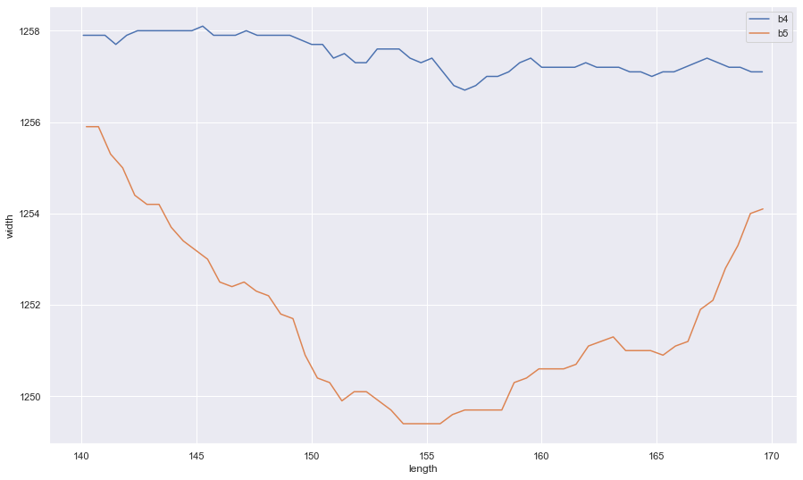

# ArcelorMittal_project

# Problem 

The client asked us to predict a fault occuring during the production process (width constriction), using only data known a priori.

Specifically a difference in width between 140-170m of more then 4-5mm is counted as a constriction.

### Example constriction

|  ||
| --- | --- |

- B4 measurment happens before downcoiling
- B5 measurment happens after downcoiling

# Solution

## Classification

Before we could create our models we first needed to classify our existing data.

To classify the data we needed to compare measuring data from before and after the downcoiling process.

Because the measuring points dont line up one-to-one we created 2 different algoritms to determine a constriction:

 - Comparing the closest points
 - Comparing the averages

both methods gave us similar results.

## Modeling

### Data

We ended up with an unbalanced dataset (which is not uncommon in fault detection) where it is difficult to create accurate models for.

There are many different methods to work with unbalanced data and because we had a lot of datapoints we chose for under-sampling.

We used a random undersampling algoritm that tries to balance out both classes.

### Models

We tried different models with the different under-sampling techniques and in the end random forest gave us the best results for our metrics so we stuck with that.

### Optimization

#### Feature Selection

